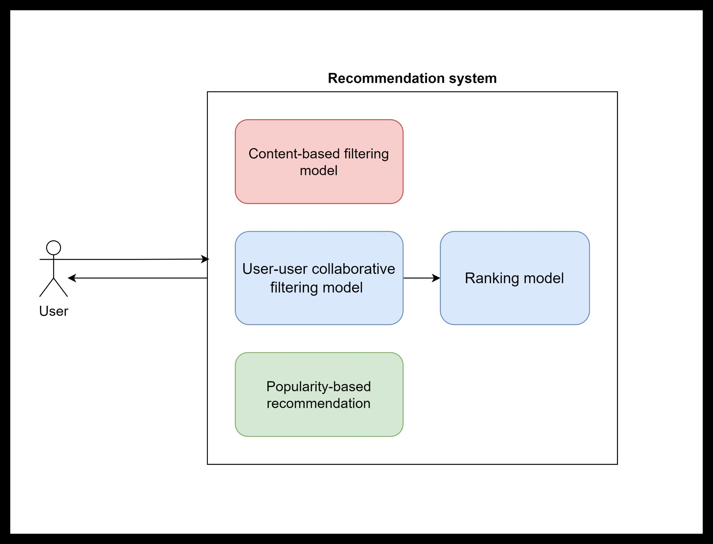

# movie_recommendation
demo: https://www.youtube.com/watch?v=hYkdJqj_Rcs

## Our recommendation system

- Use popularity-based recommendation if a new user is created. The most movies will be shown.

- Use content-based recommendation (KNN algorithm) if a user is watching a movie. The movies near that movie will be displayed.

- Use user-user collaborative filtering recommendation if a user rates enough a number of movies. The movies which some similar users watched will be presented.



## Ranking model evaluation, using ua.base as training set and ua.test as test set

| Model | NDCG@1 | NDCG@5 | NDCG@10 |
| :---: | :---: | :---: | :---: |
| RankNet | 0.5030 | 0.6339 | 0.8135 |
| LambdaRank | 0.6742 | 0.7272 | 0.8650 |
| LambdaMART (pairwise) | 0.6531 | 0.7234 | 0.8622 |
| LambdaMART (listwise) | 0.6574 | 0.7236 | 0.8626 |

**Based on evaluation, we use model LambdaRank-based lightgbm to be the ranking model in our system.**

# How to run

## Download [movielens 100K Dataset](https://grouplens.org/datasets/movielens/100k/)
Download movielens 100K Dataset and save it to movie_recommendation/data/ml-100k

## Add database creation to mysql server (here I use phpmyadmin)
Use `mydatabase.sql`

## Install necessary packages for python

```
pip install -r requirements.txt
```

## Run notebooks 
- Run `content_based/preprocessing.ipynb` to add data to mysql database

- Run `uu_ii.ipynb` to train user-user collaborative filtering model and save the model to `content_based/user_user_checkpoints/base.pkl`

- Run `ranking_models.ipynb` to train some ranking models. You can go to the section lambdaRank with lightgbm to only train this model and save it into `content/light_gbm_checkpoints/lightgbm_lambdarank.h5`

## After adding data to database, use the sql scripts below
```sql
use recommendation;

update users 
set user='admin', pwd='admin'
where user_id=1;

update users
set user='example', pwd='example'
where user_id=2;
```

- Here user='admin', password='admin' is the admin of the movie system. You can use this account to retrain the model after you see there is a large number of users and ratings. Furthermore, you can use the account to adjust the number of movies you want to recommend.

- The account user='example', password='example' is a user that has enough number of ratings. Therefore, this user can be recommended by the user-user collaborative filtering model combined with the ranking model in the system.

- If you create a new account, you can not experience the user-user collaborative filtering model because you did not rate enough.

## Running the AI server

```
python app.py
```

## Running the web server (here I use XAMPP on window)

Move the directory `movie` to  `xampp/htdocs/` (where you save xampp).

Start the modules Apache and MySQL.

## Go to localhost/movie/login.php and enjoy


